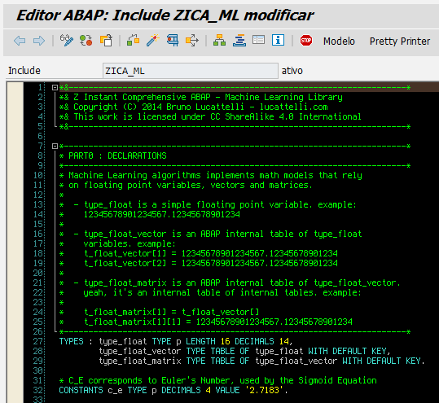
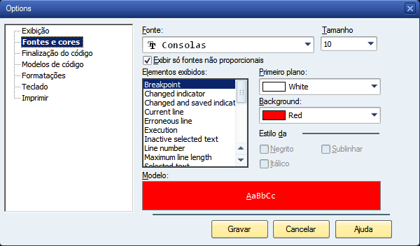

# ABAP 4 Editor Themes Collection

If you're using SAPgui's ABAP editor, you can have your own theme. Here's mine:

In this repo, you can find this and other themes as well.

# Motivation

Programmers are adopting simple code editors with dark themes and custom color schemes across different platforms and programming languages. This makes code easier to read and also gives our eyes a break from that white background.

Alexey Arseniev suggested that we created a central repo in which people can find themes and also contribute with their own versions of them.

# Installation Instructions

First, **you must be using the already-not-so-new ABAP editor**. To enable it, go to SE38 -> Utilities -> Settings -> Editor tab -> **Front-end Editor (new)**. Click OK and then **close SAPgui**.

Then, go to this folder in your machine to find the theme files:

<pre>%APPDATA%\SAP\SAP GUI\ABAP Editor\</pre>

It's recommended at this point that you create a backup of your original files.

Finally, overwrite the original theme files with the one of your choice. Start SAPgui again and your ABAP editor will now use the new theme.

One last tip for you is that you can change your font as well. To do so, you must click on the small button placed at the right corner to access the editor's options. Once there, you can change the font here:

For more fonts, you can check the [Hack](http://sourcefoundry.org/hack/) and [Terminus](http://terminus-font.sourceforge.net) fonts. Also, [this repo] (https://github.com/chrissimpkins/codeface) contains a collection of fonts for code editors.

Now you can click **Save** and start coding! :)

# Themes

Here's a list of themes currently available.

* [Bruno's ABAP Dark Theme](themes/brl-dark-editor/theme-info.md)
* [Nostalgia Theme](themes/nostalgia/theme-info.md) - for [“grumpy ABAPosaurus”](https://blogs.sap.com/2017/08/01/old-new-abap-editor/?replytocom=385416#respond)
* [tb-dark](themes/tb-dark/)
* [vscode-dark+](themes/vscode-dark+/theme-info.md)
* [dracula](themes/dracula/)
* *Insert your own theme link here...*

# Contribute with your own theme

Create a folder for your own theme inside the [themes](themes/) folder.

It may contain:
1. *_spec.xml* files for different programming languages, but no *_user.xml* files. These ones are not needed for the theme.
2. Image with an example of how scheme looks like.
3. Description with the image above and a list of all "languages" that are supported (ABAP + BSP + XML etc).

# Thanks

Thank you, Custodio de Oliveira, for adopting, customizing and sharing a version of the theme. Thank you, Alexey Arseniev for all the work you did on AB4 editor.
