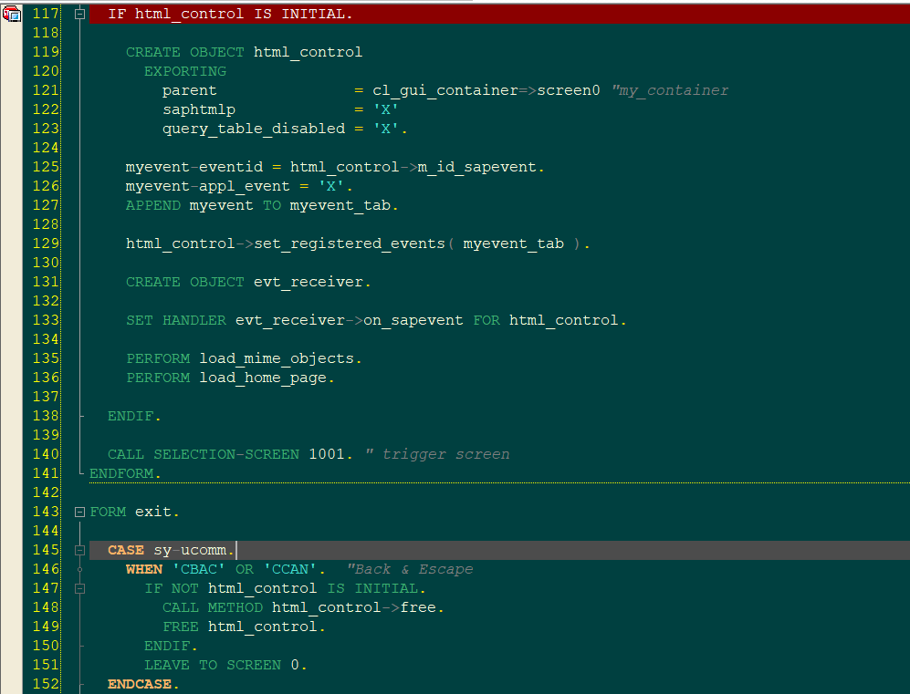

# ABAP Editor CitrusGrove theme

[](CitrusGrove_Editor.png)

ABAPers are you tired of the default appearance of the ABAP Editor in SAP NetWeaver? Do you wish to add a personal touch to your coding environment? With just a few steps, you can customize the theme of your ABAP Editor to suit your taste and make coding sessions more enjoyable.

- abap_spec.xml exported from SAP Logon 740
- font used: Courier New, size 10

# Step 1: Open ABAP Editor Directory

Begin by navigating to the ABAP Editor directory. You can do this by opening the Command Prompt and running the following command:  

```cmd
start "" "%APPDATA%\SAP\SAP GUI\ABAP Editor" 
```

Alternatively, you can directly open the folder \AppData\Roaming\SAP\SAP GUI\ABAP Editor.

# Step -2 Replace abap_spec.xml File

Once you have accessed the ABAP Editor folder, locate the abap_spec.xml file. This file contains the specifications for the editor's theme. Note: Before making any changes, it's advisable to create a backup of the original abap_spec.xml file.

Now Replace the source code of abap_spec.xml

# Supported Languages
* ABAP [(file)](abap_spec.xml)

# SAP Blog

[CitrusGrove ABAP Editor](https://community.sap.com/t5/enterprise-resource-planning-blogs-by-members/customize-the-abap-editor-theme-in-sap-netweaver/ba-p/13609550/)