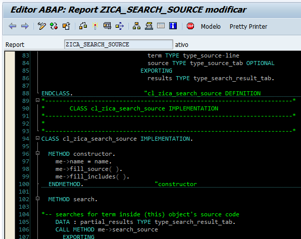

# ABAP Editor Dark Theme

I started to learn programming using [MS-DOS EDIT](http://en.wikipedia.org/wiki/MS-DOS_Editor). This was the text editor I used to write my very first BASIC program. The same happened to my first C, PASCAL and Clipper programs.

