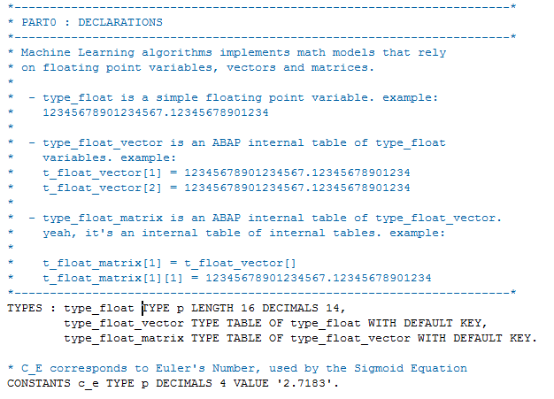
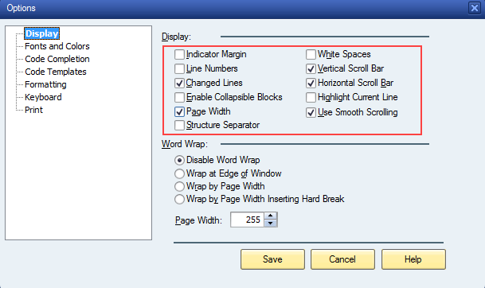

# ABAP Editor Nostalgia Theme

If you are [“grumpy ABAPosaurus”](https://blogs.sap.com/2017/08/01/old-new-abap-editor/?replytocom=385416#respond) and colors are distracting you, but you still want to get all editing features "new" ABAP editor has, you can use these theme. It emulates the color wise feeling of previous ABAP editor, where only comments are highlighted.

To get even more feeling of old editor, you need to modify display settings of the editor, taking out Indicator Margin, Numbers Margin etc (see a screenshot below):

     

# Supported Languages
* ABAP [(file)](abap_spec.xml)